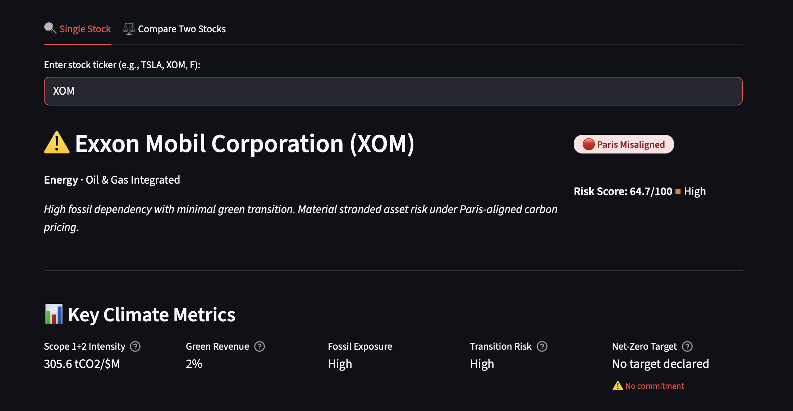

# Climate Factor Analyzer

**IFRS S2 (ISSB)-aligned climate transition risk assessment for equity analysis.**

🌍 **[Live Demo →](https://climate-factor-analyzer.streamlit.app)**

---

## What This Tool Does

This climate risk tool quantifies **transition risk** the way institutional investors actually model it: as a function of a company's carbon intensity relative to its sector decarbonization pathway, the financial cost of that exposure under plausible carbon price scenarios, and the credibility of the company's transition commitments.

For any ticker, the tool produces:

- **Scope 1+2 carbon intensity** (tCO2e per $M revenue) sourced from verified company sustainability reports where available, with proxy fallback clearly labeled
- **Peer-relative Z-score benchmarking** within sector groups (Auto, Oil & Gas, Utilities, Technology), so you see whether XOM's intensity is an outlier or industry-normal
- **Paris alignment scoring** against SBTi Sectoral Decarbonization Approach budgets, distinguishing 1.5°C vs. 2°C trajectories and flagging whether commitments are verified
- **Climate Value at Risk (Climate VaR)** across five IEA carbon price scenarios ($15–$250/tonne), expressed as percentage of EBIT at risk — separately for Scope 1+2 and full value chain (Scope 1+2+3)
- **Stranded asset signaling** at the intersection of carbon intensity and net-zero scenario VaR
- **Transition velocity** derived from capex-to-revenue trends (3-year rolling), as a proxy for revealed transition ambition vs. stated commitments
- **Analyst classification**: Clean Pure-Play / Credible Transition Leader / Early-Stage Transition / Climate Laggard / Managed Transition

---
## Coverage

**Verified emissions data** is available for 20 companies across four sectors:

| Sector | Companies |
|--------|-----------|
| Automotive | TSLA, F, GM, TM, STLA |
| Oil & Gas | XOM, CVX, COP, BP, SHEL |
| Utilities | NEE, DUK, SO, D, AEP |
| Technology | MSFT, GOOGL, AAPL, META, AMZN |

For any ticker outside this set (such as major companies like LVMH or Boeing) the tool runs in **proxy 
mode**: carbon intensity is estimated from IEA 2030 sector benchmarks adjusted by industry factor and green revenue fraction. Proxy mode results are clearly labeled in the UI and should be treated as directional, not precise.

Proxy mode still produces Paris alignment scoring, Climate VaR, and  transition risk classification, but without verified emissions data or named peer benchmarking.

**Planned expansion:** Aviation and steel, mining, and financial services 
(financed emissions via PCAF methodology), given availability of free access to a

## Methodology

TCFD was disbanded in October 2023. Its recommendations were fully absorbed into **IFRS S2 (ISSB)**, which became the mandatory climate disclosure standard effective January 2024 and has been adopted by major institutional investors for climate-related financial risk reporting.

This tool is built on IFRS S2 methodology.

> Reference: [IFRS Foundation — TCFD Transition to ISSB](https://www.ifrs.org/sustainability/tcfd/)

---

## Analytical Framework

### Carbon Intensity & Peer Z-Score

For companies in the emissions database, Scope 1+2 intensity is calculated directly:

```
Intensity (tCO2e/$M) = (Scope 1 + Scope 2_market-based) / Annual Revenue ($M)
```

Scope 2 uses the **market-based method** consistently across all peers (the standard for IFRS S2 disclosure). Tech companies with verified 100% renewable matching (RECs/PPAs) report Scope 2 = 0 under this method — this is intentional and correct. Location-based Scope 2 is stored separately and displayed for transparency.

The Z-score compares a company's intensity against its sector peer group mean and standard deviation:

```
Z = (Company Intensity − Peer Mean) / Peer Std Dev
```

Z > +1.0 → Very High relative risk | Z < −1.0 → Very Low

---

### Paris Alignment (SBTi SDA)

Paris alignment is assessed against **SBTi Sectoral Decarbonization Approach** budgets — the methodology that maps the global carbon budget onto company-level intensity targets by sector.

| Sector      | 1.5°C Budget (tCO2/$M) | 2°C Budget (tCO2/$M) |
|-------------|------------------------|----------------------|
| Auto        | 5                      | 8                    |
| Oil & Gas   | 80                     | 130                  |
| Utilities   | 400                    | 650                  |
| Technology  | 1                      | 1.5                  |

Industry-level overrides are applied where sector-level budgets would misclassify companies (e.g., a luxury goods company in Consumer Cyclical is not assessed against auto budgets).

Alignment labels distinguish between:
- ✅ **1.5°C Aligned** — within budget AND has verified net-zero commitment ≤ 2050
- 🟡 **1.5°C Consistent** — within budget, no formal commitment
- 🟡 **Paris 2°C Aligned** — within 2°C budget with commitment
- 🔴 **Committed but Off Track** — has net-zero target, but current intensity exceeds 2°C budget
- 🔴 **Paris Misaligned** — exceeds 2°C budget, no credible pathway

> Source: [SBTi Corporate Net-Zero Standard v1.1](https://sciencebasedtargets.org/resources/files/Net-Zero-Standard.pdf)

---

### Climate Value at Risk

Climate VaR quantifies the financial cost of carbon pricing as a share of EBIT:

```
Carbon Cost ($B) = Emissions (tCO2e) × Carbon Price ($/t)
Climate VaR (%) = Carbon Cost / EBIT
```

EBIT is estimated using Damodaran NYU Stern sector margin data. Two VaR figures are reported:

- **Scope 1+2 VaR** — direct operational exposure
- **Full-scope VaR** — value chain exposure using CDP 2023 Scope 3 multipliers

> Source: [Damodaran NYU Stern — Sector Margins](https://pages.stern.nyu.edu/~adamodar/New_Home_Page/datafile/margin.html)

**Five IEA NZE2050 carbon price scenarios:**

| Scenario | Price ($/tonne) |
|----------|----------------|
| Current Policy (~2024) | $15 |
| NDC Pledges (2030) | $45 |
| Paris 2°C Pathway (2030) | $75 |
| IEA Net Zero 1.5°C (2030) | $130 |
| Tail Risk (2035) | $250 |

> Source: [IEA World Energy Outlook 2023](https://www.iea.org/reports/world-energy-outlook-2023)

---

### Transition Risk Score (0–100)

The composite score integrates four components:

```
Risk Score = Intensity Component (0–40)
           − Green Revenue Derisk (0–25)
           + Paris Alignment Penalty (0–20)
           + SBTi Commitment Penalty (0–15)
```

Z-score is the preferred input for the intensity component (peer-relative). An absolute intensity floor prevents contradictions where a company is best-in-class within a high-carbon sector but still carries material VaR (e.g., a well-run coal utility is still a climate risk).

---

## Data Sources

### Emissions (Scope 1+2)
Real reported values sourced from 2023 company sustainability reports. All figures in tCO2e, market-based Scope 2.

| Company | Source |
|---------|--------|
| Tesla | [Tesla 2023 Impact Report](https://www.tesla.com/ns_videos/2023-tesla-impact-report.pdf) (third-party assured) |
| Ford | [Ford CDP Climate Disclosure 2023](https://corporate.ford.com/content/dam/corporate/us/en-us/documents/reports/2023-integrated-sustainability-and-financial-report.pdf) |
| GM | [GM 2023 Sustainability Report](https://www.gmsustainability.com/) |
| Toyota | [Toyota Environmental Report 2023](https://global.toyota/en/sustainability/report/er/) |
| ExxonMobil | [ExxonMobil 2023 Climate Report](https://corporate.exxonmobil.com/sustainability-and-reports/sustainability-report) (ISO 14064-3 assured) |
| Chevron | [Chevron 2023 Sustainability Report](https://www.chevron.com/sustainability) |
| ConocoPhillips | [COP 2023 Sustainability Report](https://www.conocophillips.com/sustainability/) |
| BP | [BP 2023 Sustainability Report](https://www.bp.com/en/global/corporate/sustainability.html) |
| Shell | [Shell 2023 Sustainability Report](https://reports.shell.com/sustainability-report/2023/) |
| NextEra Energy | [NEE 2023 ESG Report](https://www.nexteraenergy.com/sustainability.html) |
| Microsoft | [Microsoft 2023 Environmental Sustainability Report](https://blogs.microsoft.com/on-the-issues/2023/05/10/2023-environmental-sustainability-report/) |
| Alphabet | [Google 2023 Environmental Report](https://sustainability.google/reports/) |
| Apple | [Apple 2023 Environmental Progress Report](https://www.apple.com/environment/pdf/Apple_Environmental_Progress_Report_2023.pdf) |
| Meta | [Meta 2023 Sustainability Report](https://sustainability.fb.com/report/2023-sustainability-report/) |
| Amazon | [Amazon 2023 Sustainability Report](https://sustainability.aboutamazon.com/) |

### Reference Frameworks
- **SBTi Sectoral Decarbonization Approach**: [sciencebasedtargets.org](https://sciencebasedtargets.org/sectors)
- **CDP 2023 Supply Chain Report** (Scope 3 multipliers): [cdp.net](https://www.cdp.net/en/research/global-reports/supply-chain-report-2023)
- **IEA Net Zero by 2050** (carbon price pathways): [iea.org/reports/net-zero-by-2050](https://www.iea.org/reports/net-zero-by-2050)
- **Damodaran NYU Stern Sector Margins** (EBIT estimation): [pages.stern.nyu.edu/~adamodar](https://pages.stern.nyu.edu/~adamodar/New_Home_Page/datafile/margin.html)
- **IFRS S2 (ISSB)**: [ifrs.org/issued-standards/ifrs-sustainability-disclosure-standards](https://www.ifrs.org/issued-standards/ifrs-sustainability-disclosure-standards/)

---

## Sample Output



```
CLIMATE RISK REPORT: XOM — Exxon Mobil Corporation
══════════════════════════════════════════════════════

  ▶ Climate Laggard
    High fossil dependency with minimal green transition.
    Material stranded asset risk under Paris-aligned carbon pricing.

  EMISSIONS  (real data, ISO 14064-3 assured)
  ├─ Scope 1          :      92,000,000 tCO2e/yr
  ├─ Scope 2 (market) :       7,000,000 tCO2e/yr
  ├─ S1+2 Intensity   :         1,423.0 tCO2e/$M revenue
  ├─ Scope 3 Mult     : 7.5x
  └─ Green Revenue    : 2%  |  Fossil Exposure: High

  PEER BENCHMARKING  (Oil & Gas, Scope 1+2 market-based)
  ├─ Z-Score: +1.82  →  Very High relative to peers
  │    COP    :   482.12 tCO2/$M
  │    CVX    :   697.42 tCO2/$M
  │    BP     :   912.37 tCO2/$M
  │    SHEL   :  1,019.08 tCO2/$M
  │    XOM    :  1,423.00 tCO2/$M  ◀

  PARIS ALIGNMENT
  ├─ 🔴 Paris Misaligned
  ├─ 1.5°C budget: 80 | 2°C budget: 130 tCO2/$M
  └─ Intensity (1423.0) exceeds 2°C budget (130) by 994%. No credible pathway.

  CLIMATE VaR  (% EBIT at risk)
  Current Policy (~$15/t)            → S1+2: 8.4%   Full: 63.1%
  IEA Net Zero 1.5°C (~$130/t)      → S1+2: 72.9%  Full: 546.6%
  Tail Risk (~$250/t)                → S1+2: 140.2% Full: 1051.5%

  STRANDED ASSET: HIGH — Material stranded asset risk under 1.5°C scenario
```

---

## Limitations

These are not caveats added for liability. They reflect genuine constraints you should understand before using this in investment analysis.

**1. Emissions data is point-in-time (2023)**
Corporate emissions change year to year. This tool uses 2023 sustainability report data and does not auto-update. For rapidly transitioning companies (e.g., a utility mid-renewable-buildout), current-year intensity may differ materially.

**2. Scope 2 market-based vs. location-based**
Market-based Scope 2 (used here for peer consistency) reflects a company's renewable energy procurement, not actual grid emissions. A tech company claiming Scope 2 = 0 via RECs may still draw significantly from a coal-heavy grid. Location-based figures are stored separately and displayed where available.

**3. Scope 3 multipliers are sector-level proxies**
CDP 2023 multipliers are applied at the sector level. Company-specific Scope 3 (particularly Category 11 — use of sold products) varies enormously within sectors. Toyota's Scope 3 is ~60x its Scope 1+2; Tesla's is ~2x. Where this diverges from the sector proxy, the full-scope VaR figures should be treated as indicative, not precise.

**4. Revenue-based intensity denominator**
Carbon intensity per revenue ($M) is not the only valid metric. Intensity per unit of output (e.g., tCO2/MWh for utilities, tCO2/vehicle for auto) is more operationally meaningful but requires production data not available via public APIs. Revenue-based intensity is appropriate for cross-sector comparison and IFRS S2 disclosure benchmarking.

**5. Transition velocity is a capex proxy**
Capex-to-revenue trends from yfinance financials are used as a signal, not a direct measure of green investment. Companies may increase capex for non-climate reasons (M&A, maintenance). A 'Slowing' velocity signal should prompt further review, not be read as definitive.

**6. Universe coverage**
The emissions database covers 20 companies across four sectors. For tickers outside this universe, the tool falls back to IEA sector benchmarks adjusted by industry factor — these are materially less precise than verified company data.

---

## What's Next

- [ ] **AI natural language interface** — conversational stock comparison using Claude API; ask "Compare NEE and DUK on transition risk" and get a structured analyst-style response
- [ ] **2024/2025 emissions refresh** — update verified Scope 1+2 figures as companies publish new sustainability reports; track year-over-year intensity changes
- [ ] **Historical SBTi glide path** — plot a company's multi-year intensity trajectory against its 1.5°C and 2°C decarbonization budget, making convergence or divergence visible
- [ ] **Expanded database** — Industrials (GE, HON, CAT), REITs, and Financial Services; financial sector Scope 3 (financed emissions) is analytically distinct and requires PCAF methodology
- [ ] **Dashboard visualizations** — peer comparison radar charts, VaR waterfall by scenario, sector heatmap

---

## Running Locally

```bash
git clone https://github.com/durusacinti/climate-factor-analyzer
cd climate-factor-analyzer
pip install -r requirements.txt
streamlit run app.py
```

**Dependencies:** `yfinance`, `pandas`, `numpy`, `streamlit`, `matplotlib`

No API keys required. All data sourced from public company disclosures and yfinance.

---

## About

Built by **Duru Sacinti** — UC Berkeley alumna. Currently ESG Analyst at KPMG Türkiye.

I came up with this project while trying to see how far I could get toward institutional-grade transition risk analysis using only public data and learn a thing or two about quantitative climate risk modeling along the way.

[](https://linkedin.com/in/durusacinti)
[](https://github.com/durusacinti/climate-factor-analyzer)

---

*Data vintage: 2023 sustainability reports. Framework references: IFRS S2 (effective Jan 2024), SBTi Corporate Net-Zero Standard v1.1, IEA WEO 2023.*
